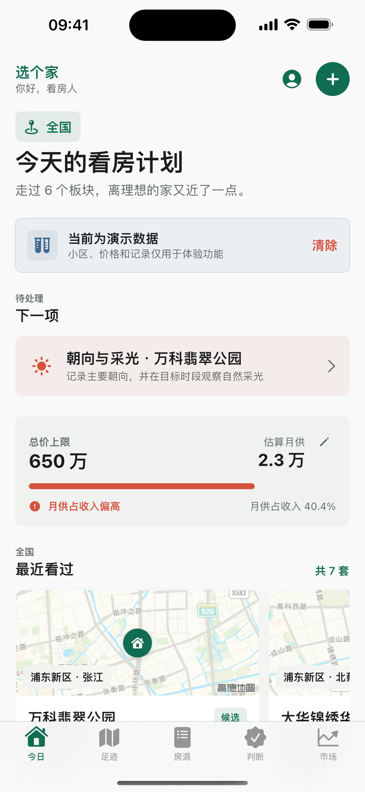
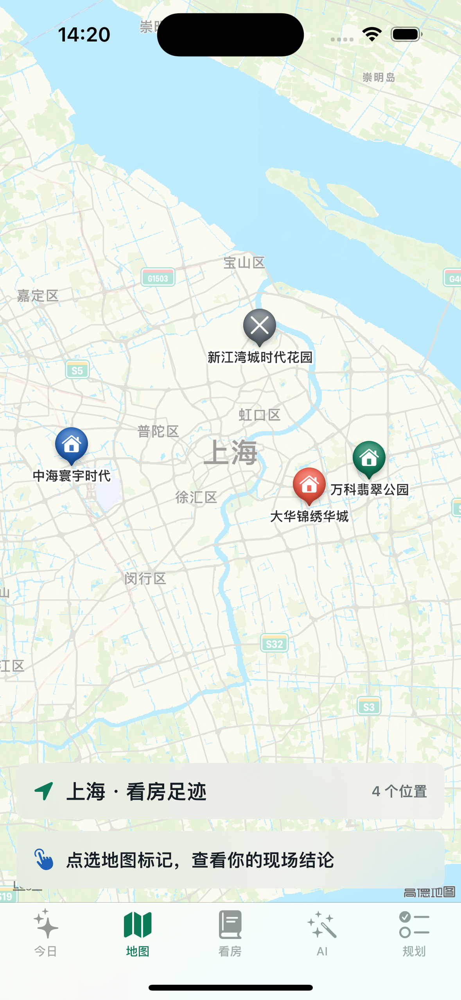
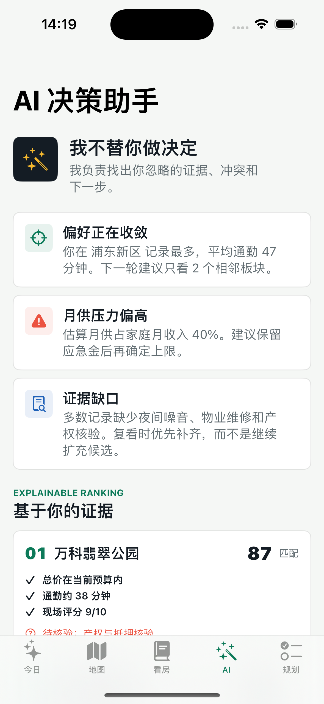

# 沪居 HuJu

沪居是一款面向上海首次购房者的 iOS 看房决策日志。它不复制房源平台，
而是把预算、板块调研、现场证据、AI 复盘和购房流程放进同一个私人工作台。

## 界面

<p>
  
  
  
</p>

## 当前原型

- 上海地图看房足迹，按候选、复看、已看和排除显示状态。
- 支持通过苹果账号登录，并预留微信开放平台服务端授权流程。
- 结构化看房日志，记录总价、面积、通勤、加分项、风险和现场判断。
- 房源时间线记录首次发现、调价、来源、复看、下架和成交变化。
- 新增房源后自动生成有事实依据的优点、短板与待核验项。
- 根据证据缺口生成复看任务，并显示房源证据完整度。
- 支持隐藏楼盘名的盲选对比和同机双人独立评分。
- 现场模式逐项记录采光、噪音、交通、楼况及尽调证据。
- 判断页基于个人记录展示匹配原因、冲突与仍待核验的证据。
- 市场页覆盖上海 2024—2026 年新房、二手房官方指数，支持选择年份、环比、同比和时间范围。
- 预算压力模型，估算首付、税费预留、月供和现金缺口。
- 数据驱动购房计划，根据预算、板块、房源和证据自动推进，线下尽调与交割事项可持久确认。
- 本地 Codable 持久化，不上传地址、收入或个人笔记。

## 产品边界

首版 AI 是实现 `AIAdvising` 协议的本地决策引擎。它用于整理用户证据，
不提供官方估价、贷款、税务、产权或学区结论。未来接入远端或端侧模型时，
必须先增加明确授权、隐私说明、数据最小化与结果溯源。

研究与决策材料：

- [产品市场分析](docs/market-analysis.md)
- [2026 竞品研究与差异化报告](docs/competitive-research-2026.md)
- [上海购房决策示例报告](docs/shanghai-buyer-decision-report-2026.md)

## 运行

环境要求：

- macOS
- Xcode 16+
- iOS 17+ Simulator

```bash
open HuJu.xcodeproj
```

或命令行构建：

```bash
xcodebuild \
  -project HuJu.xcodeproj \
  -scheme HuJu \
  -sdk iphonesimulator \
  -destination 'generic/platform=iOS Simulator' \
  CODE_SIGNING_ALLOWED=NO \
  build
```

更新国家统计局离线数据：

```bash
python3 scripts/update_market_data.py --start-year 2024 --end-year 2026
```

## 登录配置

全部本地功能无需注册或登录。首次启动直接进入空工作区，用户可以主动载入带有明确
标识的演示数据。

苹果登录是可选功能，使用系统授权组件并声明对应能力。登录标识仅保存在本机钥匙串，
不会创建开发者服务器账号或上传看房数据。

微信登录客户端原型保留在代码中，但 1.0 版本不展示该入口。待开放平台、服务端换票、
账号删除和隐私披露完整上线后再启用。

## Skills

AgentBuddy 已将 `ios-swift` 1.0.1 项目级安装到 `.trae/skills/ios-swift`。
本仓库还包含 `.trae/skills/shanghai-home-journal-ios`，用于约束后续产品、
AI、SwiftUI、MapKit、隐私与验收工作。

```bash
PATH="/opt/homebrew/bin:$PATH" \
npm_config_registry="https://bnpm.byted.org" \
npx agentbuddy@latest install
```

## Roadmap

1. 上海官方成交、可售和挂牌数据的行政区热力图。
2. 相机、语音与 OCR 快速录入现场证据。
3. 通勤锚点与多时段路线对比。
4. 经用户授权的房源链接自动导入和跨平台去重。
5. 当前政策快照与来源更新时间提示。
6. 产权、贷款和签约材料的隐私保险箱。
7. CloudKit 私有数据库跨设备同步。
